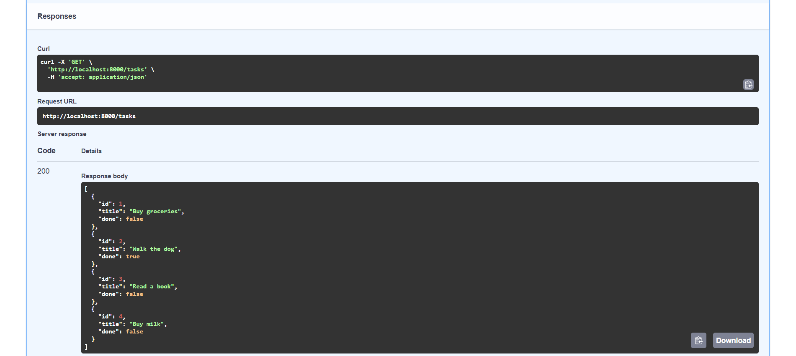
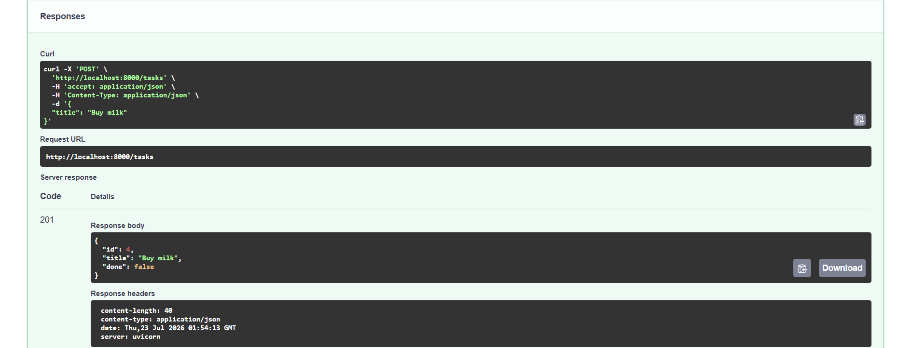
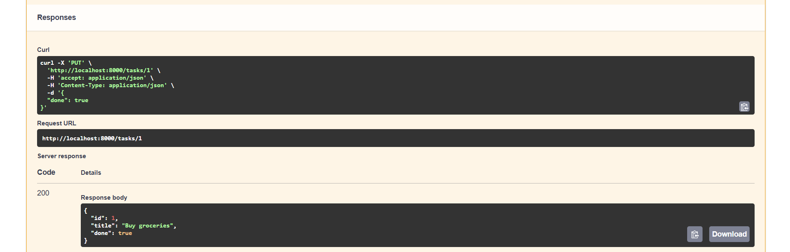
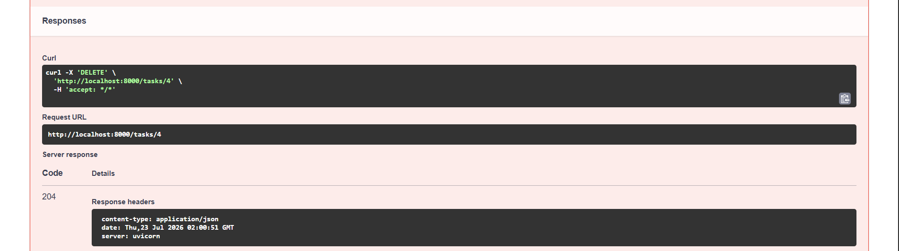

# Task API

A simple CRUD API for managing a to-do list, built with Python and FastAPI.

## Install & Run

```
pip install fastapi uvicorn
python -m uvicorn main:app --reload
```

Server runs at `http://localhost:8000`. Swagger UI is at `http://localhost:8000/docs`.

## Endpoints

| Method | Path | Description | Status Codes |
|--------|------|-------------|--------------|
| GET | `/` | API info | 200 |
| GET | `/health` | Health check | 200 |
| GET | `/tasks` | List all tasks | 200 |
| GET | `/tasks/{id}` | Get a task by ID | 200, 404 |
| POST | `/tasks` | Create a new task | 201, 400 |
| PUT | `/tasks/{id}` | Update a task | 200, 400, 404 |
| DELETE | `/tasks/{id}` | Delete a task | 204, 404 |

## Example: Create a Task

```
curl -i -X POST http://localhost:8000/tasks -H "Content-Type: application/json" -d "{\"title\":\"Buy milk\"}"
```

Response:

```
HTTP/1.1 201 Created
{"id":4,"title":"Buy milk","done":false}
```

## Swagger UI

Visit `http://localhost:8000/docs` to see interactive API documentation. You can test all CRUD operations directly from the browser.

### GET — List all tasks


### POST — Create a task


### PUT — Update a task


### DELETE — Delete a task


