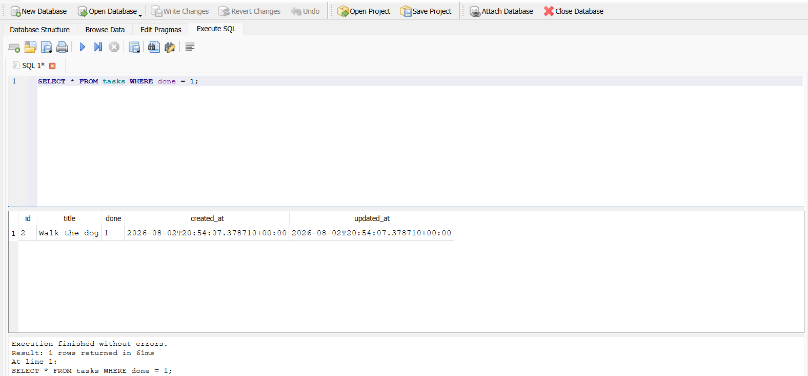
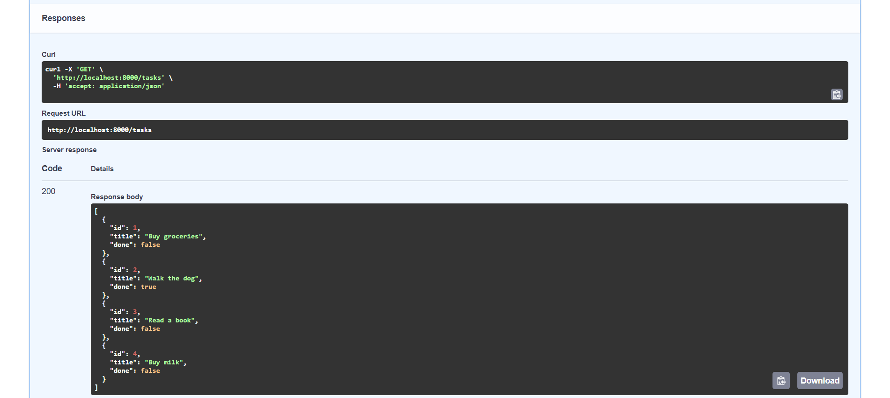
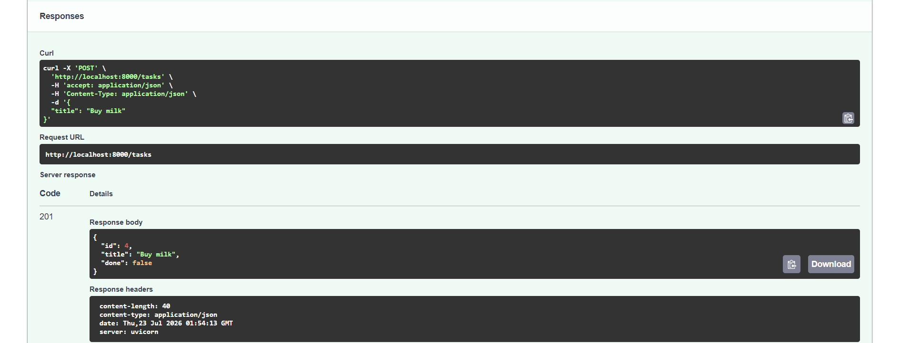
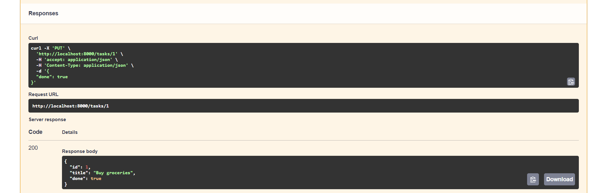
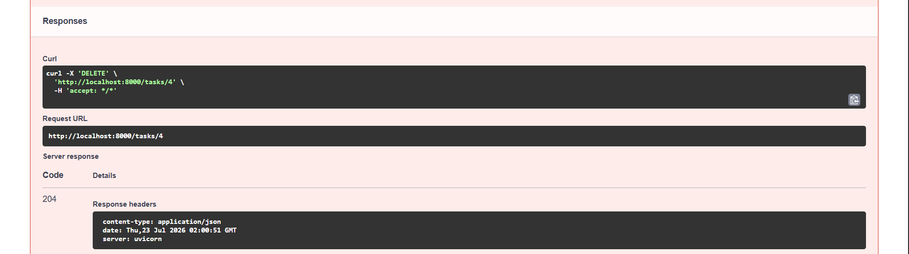

# Task API

A CRUD API for managing a to-do list, built with Python and FastAPI, backed by a SQLite database. This is the Week 3 sequel to "Build your first CRUD API": the endpoints are identical to Assignment 1, but tasks now live in a real database instead of an in-memory list — so they survive a server restart.

## Why SQLite?

SQLite is a single-file database with zero setup: no server to install or run, and your whole database is one file (`tasks.db`). Because every task is written to disk, the data outlives the program — unlike the in-memory list from Assignment 1, which emptied on every restart.

## Install & Run

Requirements: Python 3.10+ with FastAPI and Uvicorn.

```
pip install fastapi uvicorn
python -m uvicorn main:app --reload
```

Server runs at `http://localhost:8000`. Swagger UI is at `http://localhost:8000/docs`.

The database file `tasks.db` is created automatically on first run — the `tasks` table and three example tasks are set up for you. No manual setup needed.

## Endpoints

| Method | Path | Description | Status Codes |
|--------|------|-------------|--------------|
| GET | `/` | API info | 200 |
| GET | `/health` | Health check | 200 |
| GET | `/tasks` | List all tasks | 200 |
| GET | `/tasks?search=milk` | Search tasks by title (SQL `LIKE`) | 200 |
| GET | `/tasks?done=true` | Filter by done status | 200 |
| GET | `/tasks/{id}` | Get a task by ID | 200, 404 |
| GET | `/stats` | Task statistics (total / done / open) | 200 |
| POST | `/tasks` | Create a new task | 201, 400 |
| PUT | `/tasks/{id}` | Update a task | 200, 400, 404 |
| DELETE | `/tasks/{id}` | Delete a task | 204, 404 |

## Example: Create a Task

```
curl -i -X POST http://localhost:8000/tasks -H "Content-Type: application/json" -d "{\"title\":\"Buy milk\"}"
```

Response:

```
HTTP/1.1 201 Created
{"id":4,"title":"Buy milk","done":false}
```

## Storage

Tasks are stored in `tasks.db` (SQLite), not in memory. Every query uses parameterized SQL (`?` placeholders), so user input is never glued into a query string. The API behaves exactly as before — identical curl tests still pass against the database version. That is the proof that storage is just an implementation detail: the API is the promise, and the database is where the promise is kept.

### Exploring the database

I opened `tasks.db` in DB Browser for SQLite and ran SQL by hand. Example query:

```sql
SELECT * FROM tasks WHERE done = 1;
```

It returned only the completed task: `Walk the dog`.



## Swagger UI

Visit `http://localhost:8000/docs` to see interactive API documentation. You can test all CRUD operations directly from the browser.

### GET — List all tasks


### POST — Create a task


### PUT — Update a task


### DELETE — Delete a task


## Extras

### Search & filter

`GET /tasks` accepts query parameters and lets the database do the filtering with SQL clauses:

```
GET /tasks?search=milk     # WHERE title LIKE '%milk%'
GET /tasks?done=true       # WHERE done = 1
GET /tasks?search=a&done=false   # both filters combined
```

### Statistics

`GET /stats` computes the counts in SQL instead of in Python:

```
{"total": 3, "done": 1, "open": 2}
```

### Timestamps

Each task has `created_at` and `updated_at` columns (set on insert, `updated_at` refreshed on every update). Adding those columns meant changing the table's shape — easy here because `tasks.db` is git-ignored and recreated on first run. In a real app with user data, changing a table's shape needs a written-down migration so existing rows aren't lost; that's what migrations are for.
